# Second Brain

A personal knowledge capture system using Signal as the frontend and Obsidian as storage. Based on [Nate B Jones' "8 Building Blocks" architecture](https://www.youtube.com/watch?v=0TpON5T-Sw4).

Send notes to yourself via Signal. Claude classifies and files them in your Obsidian vault, commits to git, then pushes the changes to iCloud. Your devices are synced via iCloud and any changes you make directly to the notebook are also reviewed by the processing system.

## Preamble

### **WORK IN PROGRESS**

This project is incomplete. Documentation may be inconsistent until it stabilizes. I am capturing general system requirements first, then filling in details for my implementation using Signal and Obsidian. Diagrams and requirements are rough. Here is how the system works:

- A `signal-cli` front-end acts as a Signal linked device and REST API. It watches my messages, captures any "Notes to Self" (messages to my own phone number), and relays them to the processing system. I self-host this in Docker containers. No inbound ports are required.

- As messages come in, the system places them in an inbox. Claude-code processes the queue. Messages are logged unchanged as a permanent audit trail.

- Claude-code reads incoming messages, decides what to do, and updates the notebook. This is an LLM-driven extract-transform-load (ETL) pipeline—call it ECTL, where _C_ is for _classify_:

    1. **Extract** the message
    2. **Classify** its type and destination
    3. **Transform** it to match the notebook schema
    4. **Load** it into the notebook

The system generates confidence scores at every step, logs them with the message, and uses them to decide when to prompt me for clarification. These scores may also serve as training data for self-improvement. 

- iCloud syncs notebook updates to my devices (no Obsidian Sync). Incoming changes from iCloud become another message source as edits or diffs. A git worktree stages those changes for LLM processing the same way. Rsync publishes back out, with care to avoid conflicts with incoming iCloud edits.

That's the target system. The requirements structure should help others plug in different tools—Telegram, Discord, Slack, or other capture methods. Other notebook systems could work too.

I have a working notebook system without these features. Integrating them adds complexity beyond Nate's simplified structure.

**WORK IN PROGRESS**

### Risks and Challenges

1. **Getting an LLM system to reliably process messages.**

LLMs excel at some tasks (writing boilerplate TypeScript) but fail at others (counting to N). Keeping these systems following the defined process is a key challenge. Effective prompting and context management help, but LLMs need more structure than pure prompting to be reliable. The primary challenge: enforcing a core process that LLMs cannot bypass.

2. **Stable Continuous Improvement.**

The system must examine its mistakes and self-improve autonomously. This creates another escape mechanism: the LLM can rewrite its core program over time. The broader question: what are the **invariant** properties of the system? This is why I am writing formal requirements. These requirements define what must not change.

## Architecture


| Stage | Diagram | Description |
|-------|---------|-------------|
| [Capture](diagrams/01-capture.svg) |  | iOS Shortcuts & Signal → signal-cli daemon |
| [Process](diagrams/02-process.svg) |  | receipt → classify → form → bounce |
| [Storage](diagrams/03-storage.svg) |  | Obsidian vault → git hook |
| [Publish](diagrams/04-publish.svg) |  | MQTT → launchctl service → iCloud |

For detailed specifications, see [`requirements/`](requirements/).

## The 8 Building Blocks

| Block | Purpose | Implementation |
|-------|---------|----------------|
| **Capture** | Quick input from anywhere | Signal Note-to-Self, Obsidian via iCloud |
| **Sorter** | Classify and route notes | Claude agent |
| **Form** | Structured metadata | YAML frontmatter |
| **Filing Cabinet** | Organized storage | Obsidian folders |
| **Receipt** | Audit trail | `_inbox_log.md` |
| **Bouncer** | Hold low-confidence items | Confidence threshold |
| **Tap on Shoulder** | Scheduled summaries | Cron + Claude digest |
| **Fix Button** | Corrections | Signal reply ("fix: move X to People") |

## Why Signal + Obsidian

I use both daily. Signal handles delivery, encryption, and attachments. Obsidian stores everything as local markdown I control.

## Planned Flows

### Capture → Classify → File

1. Send message to Signal Note-to-Self (text, voice memo, image, share sheet)
2. signal-cli daemon receives via JSON-RPC
3. Claude classifies: person, project, idea, task, admin
4. Files to appropriate Obsidian folder with YAML frontmatter
5. Commits to git, publishes MQTT notification
6. Mac daemon pulls, iCloud syncs to Obsidian

### Daily Digest

Cron triggers Claude at 7 AM to summarize active projects, recent captures, and pending tasks. Sends digest back via Signal.

### Fix Corrections

Reply to any note with "fix: move to Projects" or "fix: tag as urgent". Claude parses the correction, updates the vault, commits.

## Open Ideas

- Use ```rclone``` to mount and bidirectionally sync iCloud?
    - ~/Library/Mobile Documents/iCloud~md~obsidian/Documents/Testcloud/.obsidian

## Status

**Current state:** Capture system specified; Processing in design

- [x] signal-cli receiving messages via REST API
- [x] Capture system requirements complete
- [x] Message encoding formats defined (`messaging-001`, `changeset-001`)
- [x] iCloud/Obsidian capture implementation specified
- [ ] Processing system implementation (claude brain-processor)
- [ ] MQTT notification layer
- [ ] Mac sync daemon
- [ ] Digest and fix flows
