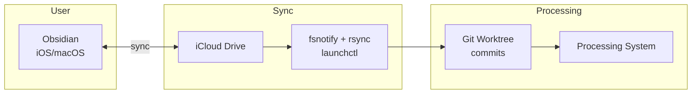

# Capture - iCloud Worktree Implementation

## Description

Users edit notes in Obsidian (iOS/macOS), synced via iCloud. A filesystem watcher detects changes, syncs them to a git worktree, and commits them as capture messages. Processing watches the worktree for new commits.

## Components

| Component | Description |
|-----------|-------------|
| Obsidian | User-facing editor (iOS/macOS) |
| iCloud | Syncs vault between devices |
| fsnotify watcher | Detects changes to iCloud vault directory |
| rsync | Copies changes to git worktree |
| Git worktree | Receives changes, commits become capture messages |
| Processing system | Watches worktree for new commits |

## Architecture



## Configuration

| Parameter | Description |
|-----------|-------------|
| `icloudVaultPath` | Path to Obsidian vault in iCloud (e.g., `~/Library/Mobile Documents/iCloud~md~obsidian/Documents/<vault>`) |
| `worktreePath` | Path to git worktree receiving changes |
| `captureSystemId` | UUID identifying this capture instance |
| `encodingId` | Encoding specification identifier (default: `changeset-001`) |
| `debounceMs` | Milliseconds to wait after last change before committing (default: 2000) |

## Implementation

### 1. Timestamp Recording

The commit timestamp records when the capture occurred.

| Source | Format |
|--------|--------|
| Git commit date | RFC 2822 |

### 2. Type Assignment

Content type is derived from file extension per [capture-types.md](capture-types.md). A commit with multiple files may contain multiple content types.

### 3. Encoding

The system produces `changeset-001` encoded messages. Each commit message includes:

```
encodingId: changeset-001

captureSystemId: <uuid>
```

The full patch (producible via `git format-patch`) constitutes the encoded message. See [capture-encoding.md](capture-encoding.md#encoding-changeset-001).

### 4. Transmission to Processing

Processing watches the git worktree for new commits. No separate transmission mechanism required — the commit to the shared worktree is the transmission.

### 5. Receiving from Processing

Processing sends responses (fix requests, clarifications) via the Signal capture system, not back through the worktree. The user receives these in Signal "Note to Self."

Direct fixes (if implemented) may be committed to the worktree and synced back to iCloud, appearing in Obsidian.

### 6. Message ID Assignment

The git commit SHA (SHA-1 or SHA-256) serves as the unique message identifier.

| Field | Source |
|-------|--------|
| Message ID | Git commit SHA |
| `captureSystemId` | Configured UUID |

### 7. Processing Confirmation

Processing confirms receipt by advancing a ref or recording the commit hash. The capture system does not delete or modify commits after creation.

## Reliability

### Persistence

Git provides inherent persistence for all commits. No separate queue required.

| Guarantee | Mechanism |
|-----------|-----------|
| Outbound persistence | Git commits are immutable once created |
| No message loss | Git history preserves all commits |

### Failure Handling

| Failure Scenario | Behavior |
|------------------|----------|
| iCloud sync delayed | Changes captured when sync completes |
| rsync fails | Retry on next fsnotify event; changes accumulate |
| Processing unavailable | Commits queue in worktree; processing catches up on restart |

### Debouncing

The system waits for a quiet period after the last change before committing, batching rapid edits into coherent commits.

## Initialization

On startup, the capture system:

1. Verifies the worktree exists and is a valid git repository
2. Verifies the iCloud vault path is accessible
3. Begins watching for filesystem changes

## Limitations

| Limitation | Notes |
|------------|-------|
| No GPS location | Filesystem changes lack location data |
| No attachment size negotiation | Large files are committed as-is; processing may reject |
| Response pathway | Fix conversations route through Signal, not back through iCloud |
