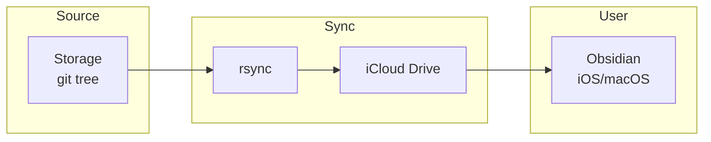

# Publish - iCloud Implementation

## Description

This implementation syncs content from Storage to iCloud Drive, making it accessible in Obsidian across all user devices. The system rsyncs the Storage git tree to the iCloud Obsidian vault path. iCloud handles distribution to devices.

## Components

| Component | Description |
|-----------|-------------|
| Storage git tree | Canonical processed content |
| rsync | Copies changed files to iCloud directory |
| iCloud Drive | Apple's sync service; distributes to user devices |
| Obsidian | User views content on iOS/macOS |

## Architecture

**Channel type:** `icloud-obsidian`

## Configuration

| Parameter | Description |
|-----------|-------------|
| `storageGitPath` | Path to Storage git tree (source) |
| `icloudVaultPath` | Path to Obsidian vault in iCloud (e.g., `~/Library/Mobile Documents/iCloud~md~obsidian/Documents/<vault>`) |
| `rsyncOptions` | Additional rsync flags (default: `-av --delete`) |
| `publishSystemId` | UUID identifying this publish instance |

**Note:** The `icloudVaultPath` is the same path used by [capture-implementation-icloud-worktree.md](capture-implementation-icloud-worktree.md). This shared path is why coordination is required — see [publish-implementation-icloud-coordination.md](publish-implementation-icloud-coordination.md).

## Functional Requirements

These map to the abstract requirements in [publish.md](publish.md):

| Requirement | Implementation |
|-------------|----------------|
| PUB-001 (receive from Storage) | Monitor Storage git tree for changes |
| PUB-002 (distribute to channels) | rsync to iCloud directory |
| PUB-003 (eventual consistency) | iCloud guarantees eventual sync to all devices |
| PUB-004 (failure handling) | Retry rsync on failure; log errors |
| PUB-005 (ordering) | Not applicable — rsync copies current state, not ordered messages |
| PUB-006 (document channel types) | Channel type: `icloud-obsidian` |
| PUB-007 (document failure policy) | See Failure Handling section |
| PUB-008 (status exposure) | Via `.publish-status` file; see [coordination](publish-implementation-icloud-coordination.md) |

**Trigger:**
Publish runs when:
1. Storage content changes (new commit to Storage git tree), AND
2. Coordination layer permits (quiet period reached)

## Failure Handling

| Failure Scenario | Behavior |
|------------------|----------|
| rsync fails (network, permissions) | Retry with exponential backoff; log error |
| iCloud directory unavailable | Halt publish; alert user; retry on next trigger |
| Storage git tree unavailable | Halt publish; alert user |
| Partial rsync (interrupted) | Next rsync completes the sync (rsync is idempotent) |
| iCloud sync delayed | Out of scope — iCloud handles device distribution |

**Delivery guarantee:** At-least-once. Content will reach iCloud directory; iCloud guarantees eventual delivery to devices.

**Idempotency:** rsync is inherently idempotent. Re-running produces the same result.

## Coordination with Capture

This implementation shares the iCloud directory with [capture-implementation-icloud-worktree.md](capture-implementation-icloud-worktree.md). Both systems MUST be deployed together.

**Required:** [publish-implementation-icloud-coordination.md](publish-implementation-icloud-coordination.md)

Publish SHALL NOT write to the iCloud directory unless permitted by the coordination layer.

## Cross-Cutting Requirements

See [general.md](general.md) for logging, configuration, security, and error handling requirements that apply to all components.
